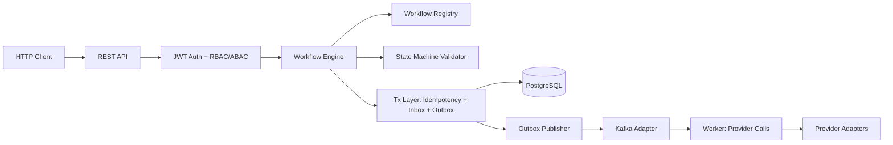

# FlowCore Architecture

## High-Level Overview

FlowCore is a modular workflow engine platform built on Spring Boot 3.x with Java 21. It provides stateful workflow execution with transactional safety, observability, and security.



## Module Dependencies

```
flowcore-api (interfaces + DTOs)
  ↑
  ├── flowcore-statemachine (DSL, validation, compilation)
  ├── flowcore-runtime (engine, persistence)
  ├── flowcore-transaction (outbox/inbox/idempotency)
  ├── flowcore-kafka (messaging)
  ├── flowcore-observability (metrics/traces/logs)
  ├── flowcore-security (auth/authz/audit)
  └── flowcore-integrations (provider adapters)
  
flowcore-starter (auto-config, imports all)
  ↑
  ├── demo-card-issuance
  └── demo-payment-lifecycle
```

## Core Concepts

### Workflow Definition
- **States**: Named positions in the workflow lifecycle
- **Steps**: Execution units linked to transitions (sync or async)
- **Transitions**: State changes triggered by events or commands
- **Guards**: Boolean expressions that gate transitions

### Execution Model
1. Command arrives (HTTP, Kafka, webhook)
2. Engine loads workflow instance within a DB transaction
3. Validates permissible transition
4. Executes step handler (sync) or enqueues async work (outbox)
5. Persists new state + token positions + outbox events
6. Commits transaction

### Reliability Patterns
- **Outbox**: Events written in same DB transaction as workflow state
- **Inbox**: Deduplication of consumed messages
- **Idempotency Keys**: Request-level dedup for HTTP/webhook
- **Saga Compensation**: Reverse-order compensation on failure

## Database Schema

See `migrations/V1__flowcore_core.sql` through `V4__demo_seed_data.sql`.

Key tables:
- `flowcore.workflow_instance` — workflow state and context (JSONB)
- `flowcore.workflow_token` — fork/join parallel execution tokens
- `flowcore.workflow_step_execution` — step attempt history
- `flowcore.workflow_timer` — scheduled timers and timeouts
- `flowcore.outbox_event` — transactional outbox events
- `flowcore.inbox_message` — consumed message deduplication
- `flowcore.idempotency_key` — request idempotency storage
- `flowcore.audit_log` — authorization audit trail

## Observability

### Metrics (Prometheus)
23+ metrics covering commands, workflows, steps, outbox, security, timers.

### Traces (OpenTelemetry → Tempo)
7 required span types: command, transition, step, outbox enqueue/publish, inbox dedup, provider calls.

### Logs (Loki)
JSON structured logs with trace correlation fields.
